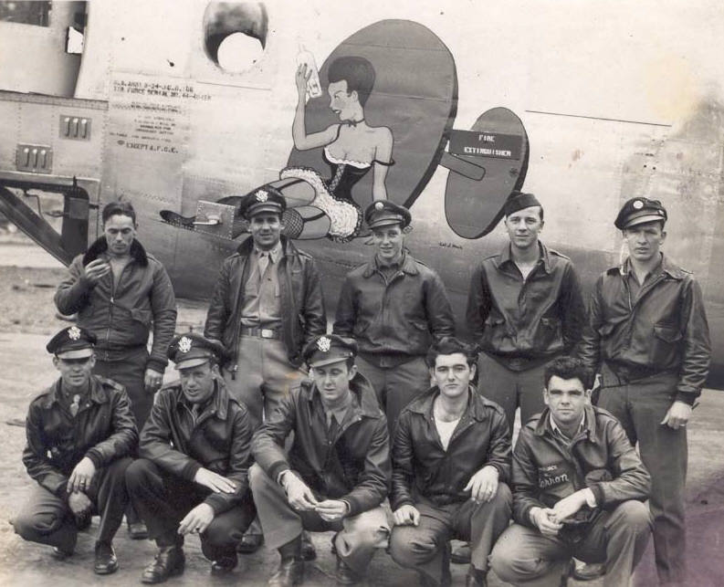
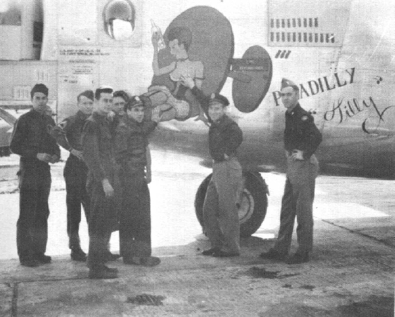
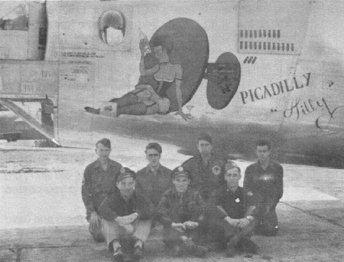

Photos of B-24s

 

44-40458 Picadilly Tilly  
  

  

With the Swenson crew, but this was not their regular plane.  
  

  

Photo: 34BG Assoc., MM188.  

Shown with the Bice crew.  

Left-Right: Blackham, Forister, Bialas, Woelfel, Humphreys, Bice and Rowley.  
  

  

Photo: 34BG Assoc., MM357.  

Shown with the Bice Crew.  

Back row (l-r): Carroll Forister, Ernie Woelfel, Jack Blackham, and Len Bialas  

Front row (l-r): Bob Bice, Ken Humphreys, and Francis Rowley.  
  

[BACK TO THIS PLANE'S COMBAT RECORD](../b24s/44-40458.md)  

[BACK TO B-24 INDEX PAGE](../000b24s.md)  

[BACK TO MAIN PAGE](../index.md)

