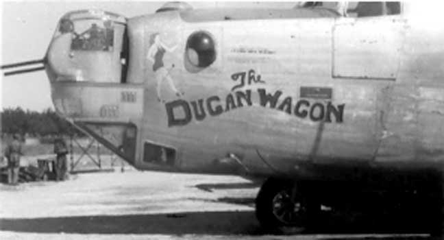

Photos of 

 

44-40482 unknown,   
later The Dugan Wagon (#2)  
  

This plane became “The Dugan Wagon” (#2) in late July 1944, after the original “Dugan Wagon” was lost.  
  

  
  

  

Photo: 34BG Assoc., MM007. (Mar. 1985\)  

With the Lindstrom Crew  

Standing (l-r): William Hammil (CP), Bennie Crawford (TG), Gordon Breeding (AG), George Morris (B), and Russell Lindstrom (P).  

Kneeling (l-r): Clarence Squires (asst. Crew Chief), Walter Aturdivan (R), James Harkless (Crew Chief), Truman Wingo (G), and Harold Witham (E).  
  

[BACK TO THIS PLANE'S COMBAT RECORD](../b24s/44-40482.md)  

[BACK TO B-24 INDEX PAGE](../000b24s.md)  

[BACK TO MAIN PAGE](../index.md)

