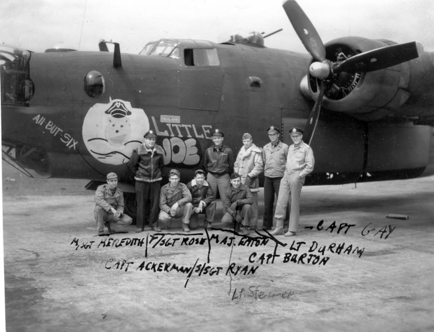

Photos of B-24s

 

Little Joe  

B-24H-CF Serial number unknown  
  

  

This was one of the 34BG's Original 72 planes. It was either renamed and/or transferred to another group before flying any combat missions with the 34BG. Shown with the plane is the crew and passengers that flew to England on this plane.  
  

[BACK TO B-24 INDEX PAGE](ValorToVictory/000b24s.md)  

[BACK TO MAIN PAGE](ValorToVictory/index.html)

