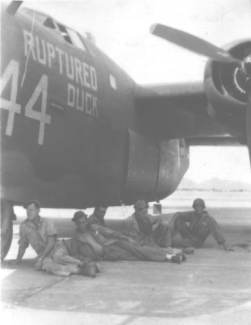

Photos of B-24s

 

Ruptured Duck  

A B-24E-FO at Blythe, CA; serial number ending with 44\.  
  

  

This was one of the 34th BG training aircraft while at Blythe Airfield. When deployed to England, this plane's crew came the similar name, The Ruptured Duck, to the new B-24H, 42-52770.  
  

[BACK TO B-24 INDEX PAGE](000b24s.md)  

[BACK TO MAIN PAGE](index.html)

