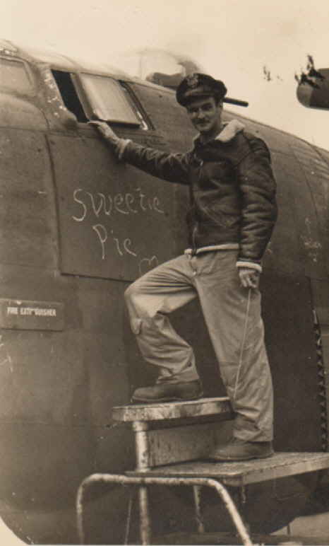
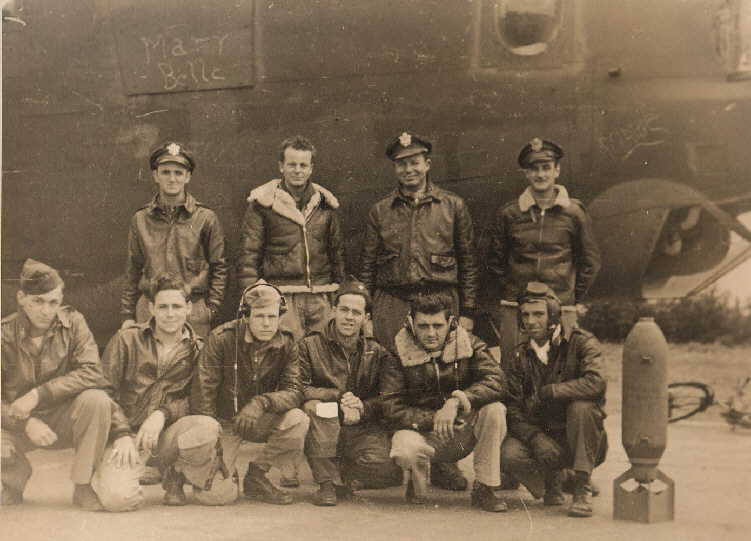

Photos of B-24s

 

Sweetie Pie / Mary Belle  

B-24H-FO Serial number unknown.  

This plane was most likely renamed, as these names appear temporary.  
  

  

With pilot, Kiley.  
  

  

The identity of this crew would help greatly in determining the serial number of this aircraft. Can anyone help here?  
  

[BACK TO THIS PLANE'S COMBAT RECORD](ValorToVictory/b24s/.md)  

[BACK TO B-24 INDEX PAGE](ValorToVictory/000b24s.md)  

[BACK TO MAIN PAGE](ValorToVictory/index.html)

